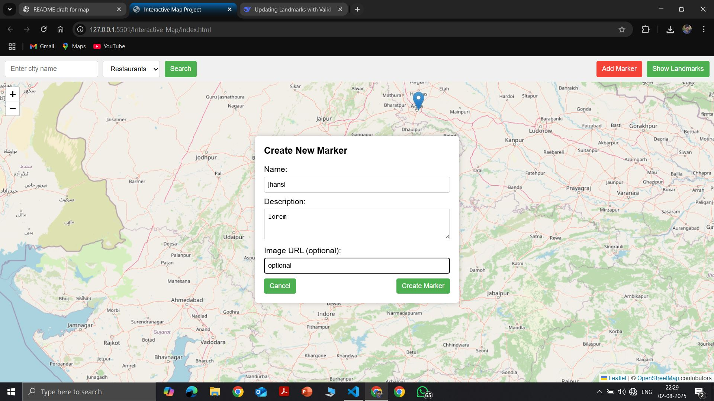

# 🗺️ Interactive Map

An interactive web-based map application that allows users to explore a city, view points of interest, filter locations, and add custom markers.  
Built using **HTML, CSS, JavaScript, Leaflet.js**, and external map APIs.

---

##  Screenshots

all points of interests are visible when open the website 

user can filter category wise for a city

create a costom marker where no marker present previously

## ✨ Features

- **Markers & Popups**  
  Display points of interest on the map with informative popups containing details.

- **Filter Places in a City**  
  Easily search and filter for locations such as:
  - 🏞️ Parks  
  - 🍴 Restaurants  
  - 🏥 Hospitals  

- **Custom Marker Placement**  
  Add your own markers anywhere on the map with a simple click.

- **Responsive & User-Friendly UI**  
  Works smoothly across devices with an intuitive design.

---

## 🛠️ Tech Stack

- **Frontend:** HTML, CSS, JavaScript  
- **Map Rendering:** Leaflet.js  
- **Data & Places:** API calls to fetch and display relevant locations  

---

## 📂 Project Structure

```
interactive-map/
│── index.html       # Main HTML file
│── styles.css        # Styles for the map and UI
│── script.js        # Core JavaScript logic
│── README.md        # Project documentation
|── images           # project demo images 
```

---

## ▶️ Running the Project

You can run this project locally in **Visual Studio Code** using the **Live Server extension**.

### Steps:
1. **Clone the repository**
   ```bash
   git clone https://github.com/Sachinkumar8439/Interactive-Map.git
   cd interactive-map
   ```

2. **Open the project in VS Code**
   ```bash
   code .
   ```

3. **Install the Live Server extension** (if not already installed).  
   - Go to Extensions (`Ctrl+Shift+X`) → search for **Live Server** → Install.

4. **Run the project**
   - Right-click `index.html` → **Open with Live Server**  
   OR  
   - Use the command:
     ```bash
     Alt+L Alt+O
     ```
     (default shortcut to start Live Server)

5. The app will open in your browser at:
   ```
   http://127.0.0.1:5500/
   ```

---

## 📜 License

This project is licensed under the MIT License.

---

## 👤 Author

**Sachin Kumar**  
🎓 B.Tech 3rd Year, IIT BHU Varanasi  

